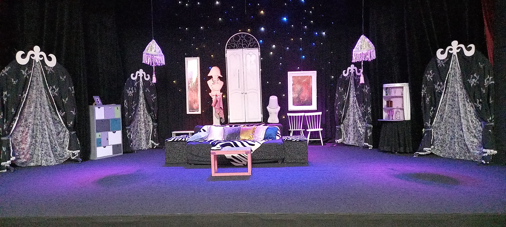

# Бестолочь
Классическая комедия положений, своеобразное исследование современного брака в форме блестящей комедии. Однажды… в одной добропорядочной семье… Глава семейства уезжает в командировку! Жена решает - погостить у мамы))) А служанку отправляют в деревню, навестить родню. Вот только одно НО – все трое, никому не сказав, возвращаются, чтоб воспользоваться опустевшим на несколько дней домом. Становится очевидным факт адюльтера! И теперь именно служанка, вчерашняя недотепа и глупышка, делает все возможное, чтобы те, кто находятся в доме, случайно не встретились друг с другом и проявляет невероятные чудеса смекалки и сообразительности. Глубокий смысл и остроумие этой веселой, но мудрой комедии, великолепная конструкция и сверкающий диалог - это замечательный подарок зрителям. Это бальзам из юмора, улыбок, смеха, прекрасное средство от плохого настроения, хандры, пессимизма.

